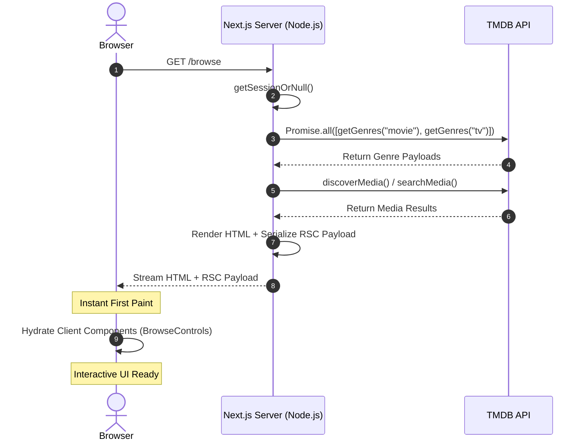
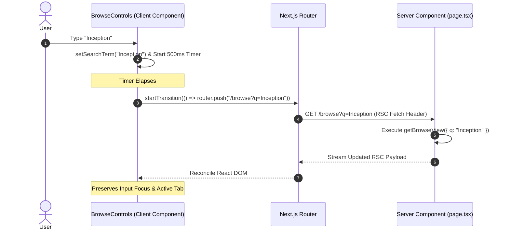
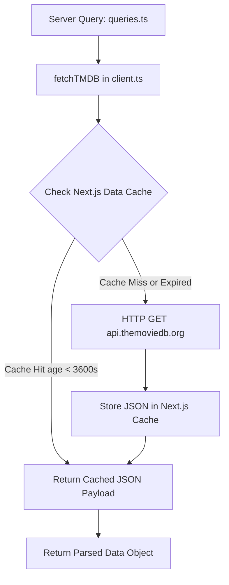
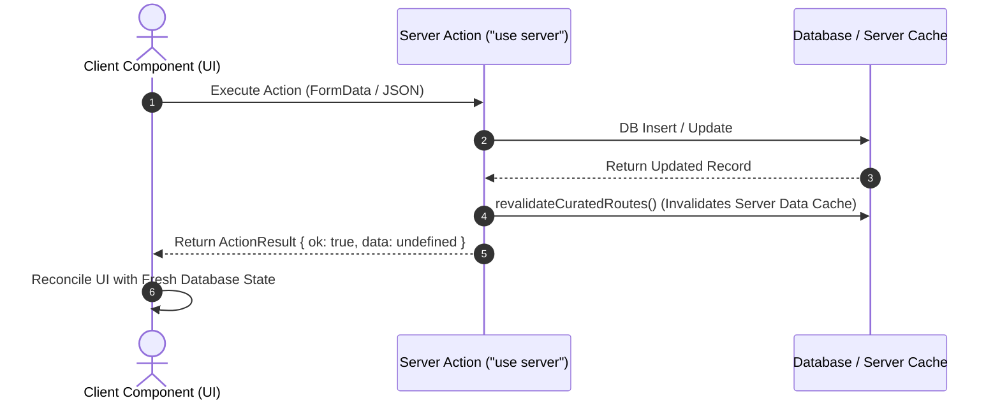

# Browse Page Architectural Deep-Dive: Rendering, Search, Fetching & Mutation Lifecycles

A technical architectural analysis of the `/browse` page in LexiFlix (`apps/web`). This document details the hybrid Server-First rendering model, interactive search reconciliation, server data orchestration, client hooks, and mutation lifecycles under the Next.js 15 App Router and React 19 architecture.

---

## Architecture Overview & Core Stack

The `/browse` route allows users to explore movies and TV shows, filtering by search query, media type (movie vs. TV), genre, release decade, and sorting criteria.

| System Layer | Architectural Pattern | Primary Responsibility |
|---|---|---|
| **Page Route (`page.tsx`)** | Async Server Component | Server-side request orchestration & RSC payload generation. |
| **Server Queries (`queries.ts`)** | `server-only` Data Module | Upstream API integration, parameter parsing & parallel queries. |
| **Interactive Controls (`browse-controls.tsx`)** | Client Component (`"use client"`) | Local input state, 500ms debouncing, URL parameter mutation. |
| **Grid & Cards (`media-grid.tsx`)** | Server/Client Presentation | Rendering media posters, release dates, ratings, and navigation links. |
| **State Authority** | Browser URL (`URLSearchParams`) | Single Source of Truth (SSOT) for all search/filter states. |

---

## 1. Initial Load & Rendering Strategy (Hybrid Server-First RSC)

LexiFlix uses a **Hybrid Server-First React Server Component (RSC)** strategy for the `/browse` page. The page is executed on the server per request (or revalidated dynamically), producing a light initial HTML shell alongside an RSC payload stream.



### 1.1 Server Component Execution (`page.tsx`)

In Next.js 15, dynamic route properties like `searchParams` are passed as Promises. The Server Component awaits `searchParams` and the user session concurrently:

```tsx
// apps/web/src/app/(app)/browse/page.tsx
export default async function BrowsePage({
  searchParams,
}: {
  searchParams: Promise<Record<string, string | string[] | undefined>>;
}) {
  const [params] = await Promise.all([searchParams, getSessionOrNull()]);
  const { results, genreMap, currentGenres, currentPage, totalPages } = await getBrowseView({
    searchParams: params,
  });

  return (
    <>
      <AppTopbar title="Browse" />
      <AppPageShell className="gap-6">
        <section className="space-y-2">
          <AppPageHeader
            heading="Browse"
            description="Explore movies and TV shows, then narrow the catalog by title, genre, and release window."
          />
          <BrowseControls genres={currentGenres} />
        </section>
        <section>
          <MediaGrid results={results} genreMap={genreMap} />
        </section>
        <section className="flex justify-center">
          <PaginationControls currentPage={currentPage} totalPages={totalPages} />
        </section>
      </AppPageShell>
    </>
  );
}
```

### 1.2 Parallel Server Data Orchestration (`queries.ts`)

Inside `getBrowseView`, the server fetches genre definitions for movies and TV shows in parallel using `Promise.all`:

```ts
// apps/web/src/features/browse/server/queries.ts
import "server-only";

import { discoverMedia, getGenres, searchMedia } from "@/lib/integrations/tmdb/client";
import type { Genre, TMDBResult } from "@/lib/integrations/tmdb/contracts";
import { buildTmdbDecadeDateRange } from "@/lib/integrations/tmdb/contracts";

interface GetBrowseViewParams {
  searchParams: Record<string, string | string[] | undefined>;
}

export async function getBrowseView({ searchParams }: GetBrowseViewParams): Promise<{
  results: TMDBResult[];
  genreMap: Record<number, string>;
  currentGenres: Genre[];
  currentPage: number;
  totalPages: number;
}> {
  const type =
    typeof searchParams.type === "string" &&
    (searchParams.type === "movie" || searchParams.type === "tv")
      ? searchParams.type
      : "movie";

  // Parallel fetch: fetch genre mappings for both media types concurrently
  const [movieGenres, tvGenres] = await Promise.all([getGenres("movie"), getGenres("tv")]);

  // Create unified map
  const genreMap: Record<number, string> = {};
  [...movieGenres.genres, ...tvGenres.genres].forEach((g) => {
    genreMap[g.id] = g.name;
  });

  const currentGenres = type === "movie" ? movieGenres.genres : tvGenres.genres;

  const q = typeof searchParams.q === "string" ? searchParams.q : undefined;
  const page = typeof searchParams.page === "string" ? Number.parseInt(searchParams.page, 10) : 1;

  const data = q
    ? await searchMedia(q, type, page)
    : await (async () => {
        const sortByParam =
          typeof searchParams.sort_by === "string" ? searchParams.sort_by : undefined;
        const discoverParams: Record<string, string | number | boolean | undefined> = {
          page,
          sort_by:
            type === "tv" && sortByParam?.startsWith("primary_release_date")
              ? sortByParam.replace("primary_release_date", "first_air_date")
              : sortByParam,
          with_genres:
            typeof searchParams.with_genres === "string" ? searchParams.with_genres : undefined,
        };

        if (typeof searchParams.decade === "string" && searchParams.decade !== "all") {
          const decadeVal = Number.parseInt(searchParams.decade, 10);
          if (!Number.isNaN(decadeVal)) {
            const range = buildTmdbDecadeDateRange(decadeVal, type);
            discoverParams[range.gteKey] = range.gteVal;
            discoverParams[range.lteKey] = range.lteVal;
          }
        }

        const dateKeys = [
          "primary_release_date.gte",
          "primary_release_date.lte",
          "first_air_date.gte",
          "first_air_date.lte",
        ] as const;

        dateKeys.forEach((k) => {
          if (typeof searchParams[k] === "string") {
            discoverParams[k] = searchParams[k] as string;
          }
        });

        return discoverMedia(type, discoverParams);
      })();

  return {
    results: data.results,
    genreMap,
    currentGenres,
    currentPage: data.page,
    totalPages: data.total_pages,
  };
}
```

### 1.3 Step-by-Step Initial Load Stages

1. **Request Ingestion:** The browser issues `GET /browse?type=movie&sort_by=popularity.desc`.
2. **Server-Side Parallel Fetching:** The Node.js server resolves the `searchParams` Promise and executes parallel queries to TMDB for genres and media discovery.
3. **RSC Serialization & HTML Stream:** Next.js renders the component tree into static HTML (containing the preliminary layout and `MediaGrid`) and serializes the React Server Component (RSC) payload.
4. **First Paint:** The browser receives the initial HTML shell and renders the layout instantly.
5. **Selective Hydration:** Client Components (`BrowseControls`, `<Select />`, `<Tabs />`) download their JS bundles and hydrate, enabling interactivity without blocking initial content rendering.

---

## 2. Interactive Search & Filter Flow

When a user types into the search input or modifies a filter dropdown, the page executes a **Soft RSC Navigation Flow**.



### 2.1 Debounced Search State (`browse-controls.tsx`)

To prevent firing network requests on every keystroke, `BrowseControls` maintains a local input state and wraps URL updates in a 500ms `setTimeout`:

```tsx
// apps/web/src/features/browse/components/browse-controls.tsx
"use client";

export function BrowseControls({ genres }: BrowseControlsProps) {
  const router = useRouter();
  const pathname = usePathname();
  const searchParams = useSearchParams();

  const [searchTerm, setSearchTerm] = useState(searchParams.get("q") || "");
  const [, startTransition] = useTransition();

  // Debounce search input changes
  useEffect(() => {
    const timer = setTimeout(() => {
      const currentQ = searchParams.get("q") || "";
      if (searchTerm !== currentQ) {
        const params = new URLSearchParams(searchParams.toString());
        if (searchTerm) {
          params.set("q", searchTerm);
          params.delete("sort_by");
          params.delete("with_genres");
          params.delete("decade");
          params.delete("primary_release_date.gte");
          params.delete("primary_release_date.lte");
          params.delete("first_air_date.gte");
          params.delete("first_air_date.lte");
        } else {
          params.delete("q");
        }
        params.delete("page");

        startTransition(() => {
          router.push(`${pathname}?${params.toString()}`);
        });
      }
    }, 500);

    return () => clearTimeout(timer);
  }, [searchTerm, pathname, router, searchParams]);
```

### 2.2 Client Hooks Deep-Dive (`useTransition`, `useSearchParams`, `usePathname`, `useRouter`)

Modern Next.js 15 & React 19 client components rely on specific client hooks to decouple UI responsiveness from asynchronous network & server transitions:

#### 1. `useTransition` (React 19)
`useTransition` allows marking state updates or client router navigations as **non-blocking concurrent transitions**.

* **Why it matters:** Without `useTransition()`, calling `router.push()` freezes the client UI until the server responds. With `useTransition()`, React keeps the current UI fully interactive (allowing typing, clicks, and tab switching) while fetching the new RSC payload stream in the background.
* **Non-blocking State:** In `BrowseControls`, `const [, startTransition] = useTransition()` wraps `router.push()` calls inside filter change events:

```tsx
const [, startTransition] = useTransition();

// Inside filter change handler:
startTransition(() => {
  router.push(`${pathname}?${params.toString()}`);
});
```

#### 2. `useSearchParams`, `usePathname`, `useRouter` (Next.js Navigation)
* `useSearchParams()` provides a read-only reactive view of the current URL query parameters.
* `usePathname()` provides the active path string (`/browse`).
* `router.push()` / `router.replace()` imperatively modifies the browser URL history. Combined with `URLSearchParams`, this maintains the browser URL as the Single Source of Truth for all filters.

---

## 3. Data Fetching & Caching Mechanisms



### 3.1 Server-Only Enforcement

Data-fetching functions in `queries.ts` are guarded with `import "server-only";`. If a developer accidentally imports a server query into a Client Component, the build fails immediately:

```ts
import "server-only";
```

### 3.2 Upstream Integration & HTTP Fetch Deduplication

LexiFlix's TMDB client leverages Next.js native `fetch` cache options:

```ts
// apps/web/src/lib/integrations/tmdb/client.ts
import { env } from "@/lib/config/env";

const BASE_URL = "https://api.themoviedb.org/3";

type FetchOptions = {
  tags?: string[];
  revalidate?: number;
};

async function fetchTMDB<T>(
  endpoint: string,
  params: Record<string, string | number | boolean | undefined> = {},
  options: FetchOptions = {},
): Promise<T> {
  const searchParams = new URLSearchParams({
    api_key: env.TMDB_API_KEY,
  });

  for (const [key, value] of Object.entries(params)) {
    if (value !== undefined && value !== null && value !== "") {
      searchParams.append(key, String(value));
    }
  }

  const res = await fetch(`${BASE_URL}${endpoint}?${searchParams.toString()}`, {
    next: {
      tags: options.tags,
      revalidate: options.revalidate ?? 3600, // Default 1 hour cache
    },
  });

  if (!res.ok) {
    throw new Error(`TMDB Error: ${res.status} ${res.statusText}`);
  }

  return res.json();
}
```

* **Automatic Request Deduplication:** If `BrowsePage` calls `getGenres("movie")` multiple times during a single render tree, Next.js automatically dedupes the HTTP requests into a single network call.
* **Time-Based Revalidation:** Data is cached on the server for 3600 seconds (`revalidate: options.revalidate ?? 3600`), protecting upstream APIs from rate limits.

---

## 4. Mutation Lifecycle & Revalidation

When users interact with media cards or catalog items (such as curating an entry from discovery), mutations execute via **Next.js Server Actions**.



### 4.1 Discriminated ActionResult Contract & Server Actions

In LexiFlix, all Server Actions return a discriminated union `ActionResult<T>` defined in `apps/web/src/lib/contracts/action-result.ts`:

```ts
// apps/web/src/lib/contracts/action-result.ts
export type ActionResult<T = undefined> =
  | { ok: true; data: T }
  | { ok: false; error: string; fieldErrors?: Record<string, string[]> };
```

Mutations (such as curating a TMDB item) execute Server Actions that parse FormData with Zod and invalidate cached paths via helper functions:

```ts
// apps/web/src/features/curation/server/actions.ts
"use server";

import { revalidatePath } from "next/cache";
import { z } from "zod";
import { requireAdmin } from "@/lib/auth/guards";
import type { ActionResult } from "@/lib/contracts/action-result";
import { upsertCuratedEntryFromTmdb } from "@/features/curation/server/queries";

const tmdbMutationSchema = z.object({
  mediaType: z.enum(["movie", "tv"]),
  tmdbId: z.coerce.number().int().positive(),
});

function revalidateCuratedRoutes() {
  revalidatePath("/admin/curated");
  revalidatePath("/curated");
}

export async function curateTmdbItemAction(formData: FormData): Promise<ActionResult> {
  const session = await requireAdmin();
  const parsed = tmdbMutationSchema.parse({
    mediaType: formData.get("mediaType"),
    tmdbId: formData.get("tmdbId"),
  });

  await upsertCuratedEntryFromTmdb(parsed.mediaType, parsed.tmdbId, session.user.id);
  revalidateCuratedRoutes();
  return { ok: true, data: undefined };
}
```

### 4.2 Client Mutation Handling & Form Actions

On the client side, components trigger Server Actions directly via HTML form actions combined with `useFormStatus`:

```tsx
// Example from admin-discover-row.tsx
function SubmitButton({ isCurated }: { isCurated: boolean }) {
  const { pending } = useFormStatus();

  return (
    <Button
      type="submit"
      variant={isCurated ? "ghost" : "outline"}
      size="sm"
      disabled={pending}
    >
      {pending ? <Loader2 className="size-3.5 animate-spin" /> : "Curate"}
    </Button>
  );
}

export function AdminDiscoverRow({ result, mediaType, isCurated }: AdminDiscoverRowProps) {
  const submit = isCurated ? refreshCuratedEntryAction : curateTmdbItemAction;

  return (
    <div className="group flex items-center gap-3 px-4 py-2.5">
      <form action={submit} className="shrink-0">
        <input type="hidden" name="mediaType" value={mediaType} />
        <input type="hidden" name="tmdbId" value={String(result.id)} />
        <SubmitButton isCurated={isCurated} />
      </form>
    </div>
  );
}
```

1. **`revalidateCuratedRoutes()`:** Instructs the Next.js server data cache to purge cached payloads for `/curated` and `/admin/curated`.
2. **Form Action Processing:** Next.js handles server execution seamlessly and re-renders affected client views with updated state post-mutation.

---

## 5. Architectural Takeaways

1. **URL as Single Source of Truth:** Relying on `searchParams` for search queries, filters, and pagination ensures deep-linkability and eliminates client-side state duplication.
2. **Unblocked Interactivity:** `useTransition` and debounced inputs ensure typing remains 60fps fast while server data streams asynchronously over the network.
3. **Server-First Boundary Protection:** `"server-only"` modules guarantee sensitive API keys and raw database utilities never bleed into browser JS bundles.
