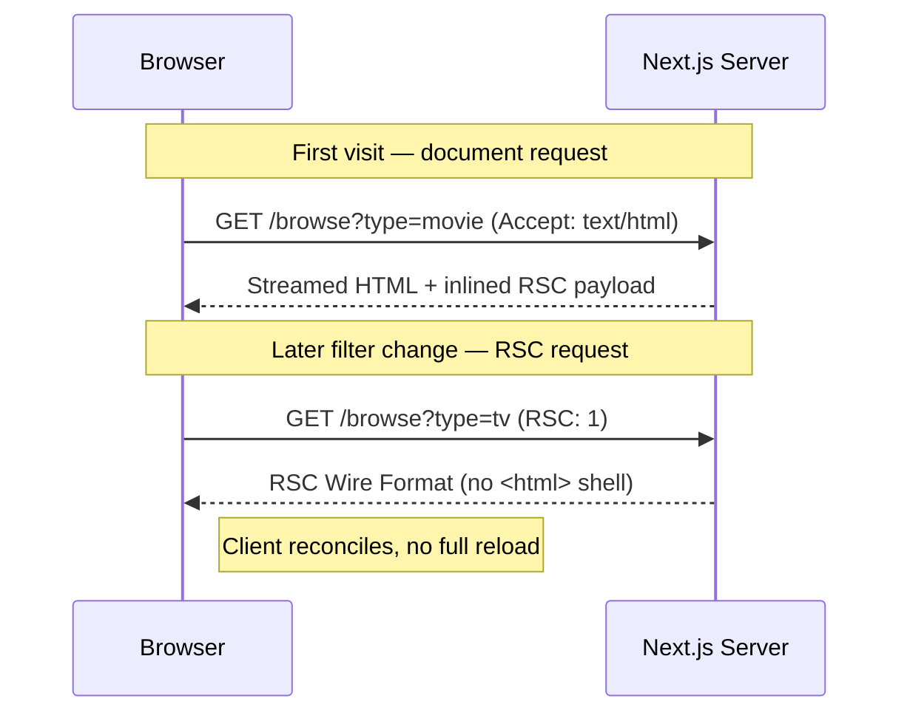
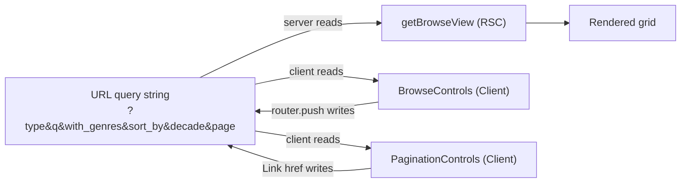
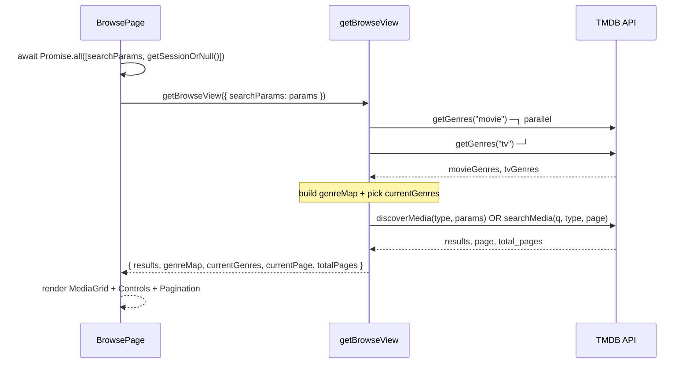
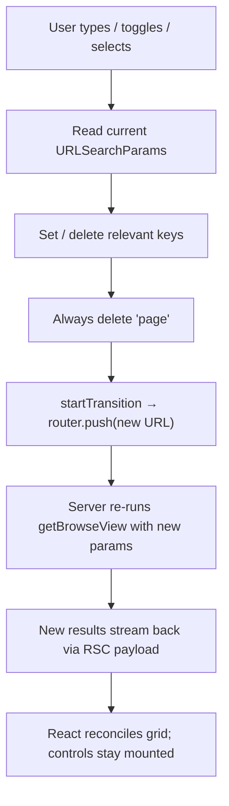
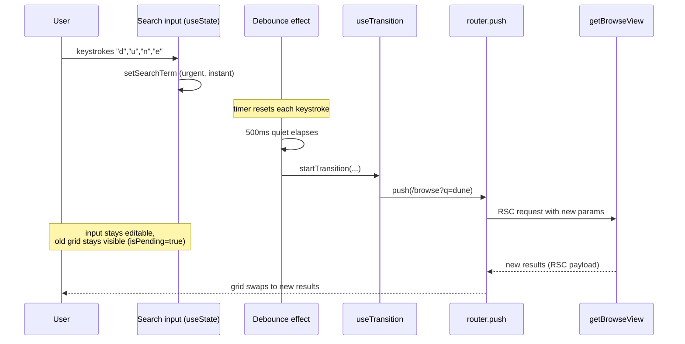
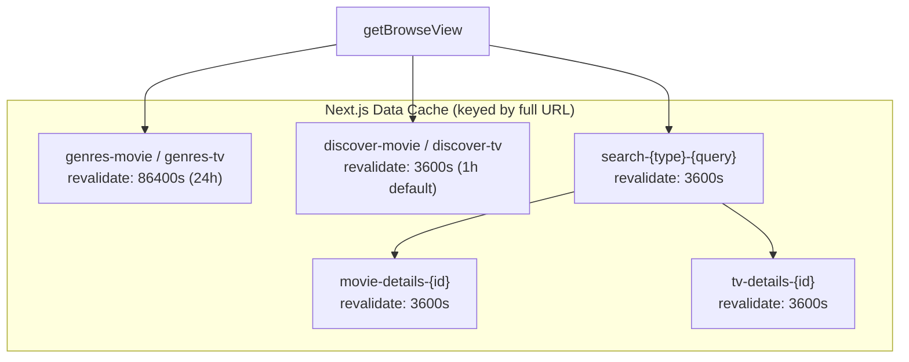
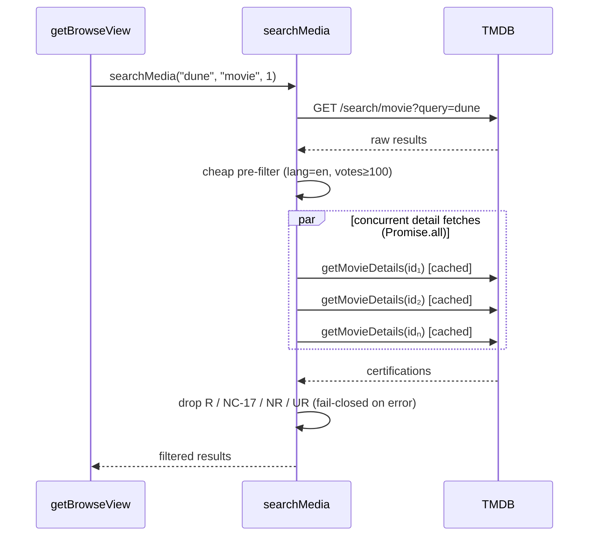
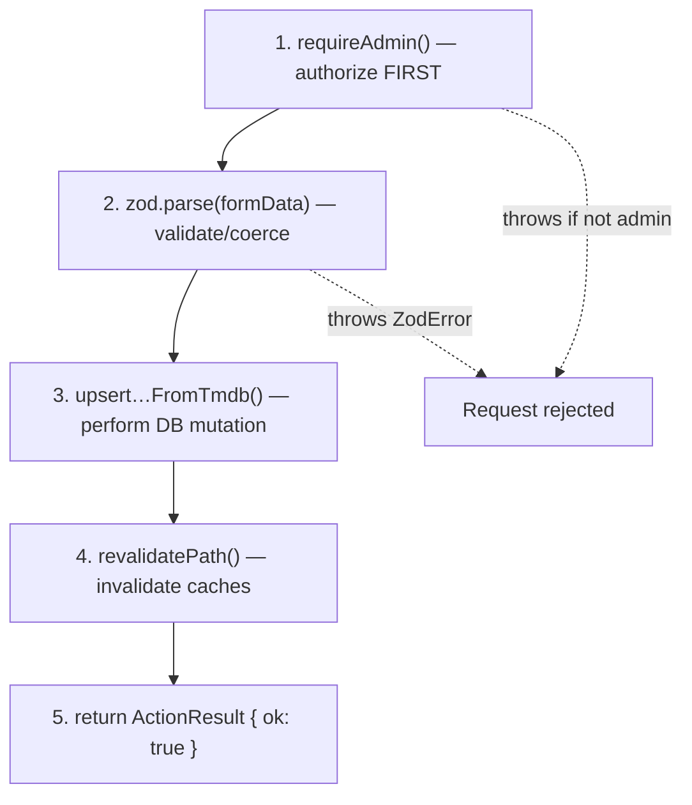
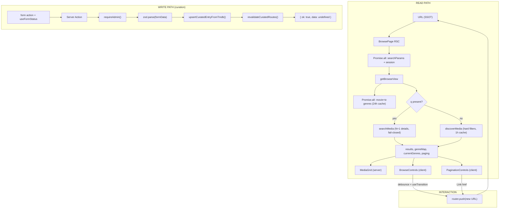

# The Browse Page: An Architectural Masterwork on Rendering, Reconciliation, Fetching, and Mutation in Next.js 15

│ **Case study surface:** app/(app)/browse/page.tsx, features/browse/server/queries.ts, features/browse/components/browse-controls.tsx, features/browse/components/media-grid.tsx, lib/integrations/tmdb/client.ts, and features/curation/server/actions.ts.

This document explains, end to end, how a modern Next.js 15 / React 19 application renders a data-heavy, filterable catalog page. It uses LexiFlix's Browse experience as a concrete, real-world specimen rather than a toy example. Every code snippet below is taken verbatim from the repository.

━━━━━━━━━━━━━━━━━━━━━━━━━━━━━━━━━━━━━━━━


## Table of Contents

1. [Prerequisites and Mental Models](#1-prerequisites-and-mental-models)
2. [Initial Load and Parallel Data Orchestration](#2-initial-load-and-parallel-data-orchestration)
3. [Interactive Search, Filter Reconciliation, and useTransition](#3-interactive-search-filter-reconciliation-and-usetransition)
4. [Data Fetching and the TMDB Caching Layer](#4-data-fetching-and-the-tmdb-caching-layer)
5. [Mutation Lifecycles: ActionResult<T> and revalidatePath](#5-mutation-lifecycles-actionresultt-and-revalidatepath)
6. [Code Review Checklist](#6-code-review-checklist)

━━━━━━━━━━━━━━━━━━━━━━━━━━━━━━━━━━━━━━━━


## 1. Prerequisites and Mental Models

Before tracing a single request, four mental models must be firmly in place. Every architectural decision in the Browse page is downstream of these.

### 1.1 HTTP as the substrate

Next.js does not replace HTTP; it choreographs it. Two request shapes matter for Browse:

- **Document requests** (GET /browse?type=movie&page=2): the browser asks for a full HTML document. The server runs the React Server Component (RSC) tree, streams HTML, and inlines the serialized component payload.
- **RSC navigation requests**: when a client-side navigation occurs (e.g., router.push), Next.js issues a GET with the header RSC: 1. The server responds not with HTML but with the RSC Wire Format — a streaming, serialized description of the new server tree. No full document reload happens.

The distinction is the entire reason client-side filtering feels instant while remaining server-rendered. A router.push("/browse?q=dune") is a data request, not a page reload.


### 1.2 The URL as the Single Source of Truth (SSOT)

The most important architectural decision in Browse is that all view state lives in the URL query string, never in a client store. Type, query, genre, sort, decade, and page are all URL params.

This is visible in every consumer. The server query reads them:
```ts
// features/browse/server/queries.ts
const type =
  typeof searchParams.type === "string" &&
  (searchParams.type === "movie" || searchParams.type === "tv")
    ? searchParams.type
    : "movie";
```

The client controls read the same params rather than holding their own truth:
```ts
// features/browse/components/browse-controls.tsx
const currentType = searchParams.get("type") || "movie";
const currentGenre = searchParams.get("with_genres") || "all";
const currentSort = searchParams.get("sort_by") || "popularity.desc";
const currentDecade = searchParams.get("decade") || "all";
```

The payoff of URL-as-SSOT:

- **Shareable / bookmarkable** state: a filtered view is just a link.
- **Zero hydration mismatch risk** for filter state — the server and client derive the same values from the same URL.
- **Back/forward buttons work for free**, because navigation is state change.
- **No global store** to keep in sync with the server.


The critical invariant: only the URL writes state, and everything else reads from it. Controls never mutate a local filter object that could drift from what the server rendered.

### 1.3 RSC vs Client Components

The Browse tree is a deliberate mix. Understanding the boundary is essential.

| Component | Kind | Why |
|-----------|------|-----|
| BrowsePage | Server | async function, awaits data, no interactivity |
| getBrowseView | Server-only module (import "server-only") | Talks to TMDB with an API key |
| MediaGrid | Server | Pure presentational mapping over results |
| MediaCard | Server | Renders next/image, Link — no client hooks |
| BrowseControls | Client ("use client") | Uses useState, useEffect, useTransition, useRouter |
| PaginationControls | Client ("use client") | Uses usePathname, useSearchParams |

The page.tsx file is a Server Component (note it is async and has no "use client"):
```ts
// app/(app)/browse/page.tsx
export default async function BrowsePage({
  searchParams,
}: {
  searchParams: Promise<Record<string, string | string[] | undefined>>;
}) {
  const [params] = await Promise.all([searchParams, getSessionOrNull()]);
  const { results, genreMap, currentGenres, currentPage, totalPages } = await getBrowseView({
    searchParams: params,
  });
  return (
    <>
      <AppTopbar title="Browse" />
      <AppPageShell className="gap-6">
        <section className="space-y-2">
          <AppPageHeader heading="Browse" description="Explore movies and TV shows…" />
          <BrowseControls genres={currentGenres} />
        </section>
        <section>
          <MediaGrid results={results} genreMap={genreMap} />
        </section>
        <section className="flex justify-center">
          <PaginationControls currentPage={currentPage} totalPages={totalPages} />
        </section>
      </AppPageShell>
    </>
  );
}


Note the data flow: the Server Component fetches everything and passes plain serializable props (results, genreMap, currentGenres, currentPage, totalPages) down into client components. The client components receive already-fetched data; they never fetch the catalog themselves. This is the "server fetches, client interacts" pattern.

mermaid
flowchart TD
    subgraph Server["Server Components (run on server)"]
        Page["BrowsePage (async)"]
        Query["getBrowseView<br/>server-only"]
        Grid["MediaGrid"]
        Card["MediaCard × N"]
    end
    subgraph Client["Client Components (hydrate in browser)"]
        Controls["BrowseControls"]
        Pager["PaginationControls"]
    end
    Page --> Query
    Query -->|results, genreMap| Grid
    Grid --> Card
    Page -->|currentGenres| Controls
    Page -->|currentPage, totalPages| Pager
    style Server fill:#1e3a5f,color:#fff
    style Client fill:#5f1e3a,color:#fff
```

The boundary rule: a Server Component may render a Client Component and pass serializable props to it, but a Client Component may only render a Server Component if that server node was passed in as children/props. In Browse, the server always sits above the client leaves, so this constraint is satisfied cleanly.

### 1.4 The RSC Wire Format

When getBrowseView returns results, those objects are not re-fetched on the client. The server serializes the rendered tree — including the already-computed props flowing into MediaGrid and BrowseControls — into the RSC Wire Format. This is a line-based, streamable protocol (rows like 0:, 1: referencing module chunks and prop payloads), not HTML and not plain JSON.

Two consequences drive the design:

1. Everything crossing the server→client boundary must be serializable. results (arrays of TMDBResult), genreMap (a Record<number, string>), and currentGenres are all plain data — this is why they cross cleanly. A Date, a class instance, or a function (other than a Server Action reference) would break serialization.
2. Client components in the payload are references, not code. The wire format points at the BrowseControls chunk; the browser downloads that JS separately and hydrates it with the serialized props.

### 1.5 Dynamic searchParams as a Promise

In Next.js 15, searchParams is a Promise, not a plain object. This is the signal that the page is dynamic — it depends on request-time input and cannot be statically prerendered without deopting to runtime.
```ts
searchParams: Promise<Record<string, string | string[] | undefined>>;


Awaiting it is what makes the route dynamic. The Browse page awaits it alongside the session:

typescript
const [params] = await Promise.all([searchParams, getSessionOrNull()]);
```

This Promise-based API exists so Next.js can begin rendering the static shell (and stream it) before the dynamic params resolve, enabling partial prerendering strategies. The type-level Promise forces you to await, which is the explicit opt-in to dynamic rendering.

━━━━━━━━━━━━━━━━━━━━━━━━━━━━━━━━━━━━━━━━


## 2. Initial Load and Parallel Data Orchestration

### 2.1 The waterfall you must avoid

The naive version of a page like this fetches sequentially: session, then movie genres, then TV genres, then results. Each await blocks the next — a request waterfall that multiplies latency.

Browse avoids this at two levels.

Level 1 — page level. Session and params resolve together:
```ts
const [params] = await Promise.all([searchParams, getSessionOrNull()]);


Level 2 — query level. The two genre lists fetch concurrently inside getBrowseView:

typescript
// features/browse/server/queries.ts
// Fetch Genres (Always needed for controls and card mapping)
// We use Promise.all to fetch them in parallel
const [movieGenres, tvGenres] = await Promise.all([getGenres("movie"), getGenres("tv")]);
```

### 2.2 The unavoidable dependency

There is one genuine sequential dependency: the catalog fetch depends on type and other params, which come from the resolved searchParams. So the orchestration is: resolve params → fetch genres in parallel → fetch results. Genres and results are not parallelized with each other in the current code because currentGenres derivation is cheap and the results fetch is the dominant cost.


### 2.3 Building the genre map

Genres arrive as two separate lists (movie IDs and TV IDs differ). Browse flattens them into a single lookup so any card — regardless of media type — can resolve genre names:
```ts
// Create unified map
const genreMap: Record<number, string> = {};
[...movieGenres.genres, ...tvGenres.genres].forEach((g) => {
  genreMap[g.id] = g.name;
});

// Current genres for controls (depend on type)
const currentGenres = type === "movie" ? movieGenres.genres : tvGenres.genres;


Two derived outputs from one fetch: genreMap (unified, for MediaCard display) and currentGenres (type-specific, for the BrowseControls genre dropdown). MediaCard then consumes the map without any fetching of its own:

typescript
// features/browse/components/media-card.tsx
const genres = media.genre_ids
  .slice(0, 2)
  .map((id) => genreMap[id])
  .filter(Boolean);
```

### 2.4 The loading state and streaming

loading.tsx is a first-class part of the lifecycle. Next.js automatically wraps the route segment in a <Suspense> boundary whose fallback is this file. While getBrowseView awaits TMDB, the user sees a skeleton that mirrors the real layout's two zones (controls + grid):
```ts
// app/(app)/browse/loading.tsx
export default function BrowseLoading() {
  return (
    <AppPageShell className="gap-8">
      {/* Zone A Loading — controls */}
      {/* Zone B Loading — 10 card skeletons */}
      {Array.from({ length: 10 }, (_, index) => `browse-loading-${index}`).map((key) => (
        <div key={key} className="space-y-3">
          <Skeleton className="aspect-[2/3] w-full rounded-xl" />
          {/* … */}
        </div>
      ))}
    </AppPageShell>
  );
}


mermaid
flowchart LR
    Nav["Navigate to /browse"] --> Shell["Static shell streams instantly"]
    Shell --> Susp["Suspense boundary shows loading.tsx skeleton"]
    Susp --> Await["getBrowseView awaits TMDB"]
    Await --> Swap["Resolved grid streams in, replaces skeleton"]
```

The skeleton deliberately renders 10 poster placeholders matching the grid's aspect-[2/3] cards, so the layout does not shift when real data arrives — a small but real CLS (Cumulative Layout Shift) safeguard.

━━━━━━━━━━━━━━━━━━━━━━━━━━━━━━━━━━━━━━━━


## 3. Interactive Search, Filter Reconciliation, and useTransition

This is the heart of the client experience and the most subtle part of the architecture. The mission: let users type, toggle tabs, and pick filters with an instant-feeling UI, while the server remains the source of rendered results and the URL remains the SSOT.

### 3.1 The reconciliation model

Every control does the same fundamental thing: read current params → produce a new URL → router.push inside a transition. The server re-renders from the new URL. There is no client-side filtering of results at all — filtering is a server concern, expressed through the URL.


### 3.2 Debounced search

Free-text search must not fire a request per keystroke. BrowseControls holds the input value in local useState (the one piece of ephemeral state that is not yet in the URL), then debounces a commit into the URL after 500 ms of quiet:
```ts
// features/browse/components/browse-controls.tsx
const [searchTerm, setSearchTerm] = useState(searchParams.get("q") || "");
const [, startTransition] = useTransition();

// Debounce search
useEffect(() => {
  const timer = setTimeout(() => {
    const currentQ = searchParams.get("q") || "";
    if (searchTerm !== currentQ) {
      // If searching, we clear filters to avoid confusion
      const params = new URLSearchParams(searchParams.toString());
      if (searchTerm) {
        params.set("q", searchTerm);
        // Clear discovery filters
        params.delete("sort_by");
        params.delete("with_genres");
        params.delete("decade");
        params.delete("primary_release_date.gte");
        params.delete("primary_release_date.lte");
        params.delete("first_air_date.gte");
        params.delete("first_air_date.lte");
      } else {
        params.delete("q");
      }
      params.delete("page"); // Reset page

      startTransition(() => {
        router.push(`${pathname}?${params.toString()}`);
      });
    }
  }, 500);

  return () => clearTimeout(timer);
}, [searchTerm, pathname, router, searchParams]);


Several deliberate details:

- **The guard if (searchTerm !== currentQ)** prevents a redundant push when the local state already agrees with the URL (e.g., after a back-navigation rehydrates the input).
- **Search and discovery filters are mutually exclusive.** Committing a search clears sort_by, with_genres, decade, and all date-range keys. This is a domain rule (TMDB's /search endpoint doesn't honor discover filters), and the UI reinforces it by disabling those selects while searching:

 typescript
  const isSearching = !!searchTerm;
  // …
  <Select disabled={isSearching} …>
  
- **params.delete("page")** on every change resets pagination. Changing a filter while on page 7 must not leave you stranded on a page-7 request against a different result set.
- **The cleanup return () => clearTimeout(timer)** is what actually implements the debounce: each keystroke re-runs the effect, cancelling the prior pending timer.
```

### 3.3 useTransition in React 19

Every navigation is wrapped in startTransition. This marks the resulting re-render as a non-urgent transition. The practical effects:

1. The input stays responsive. Typing updates searchTerm (urgent) while the pending server round-trip is a transition (non-urgent). React does not block the text field on the navigation.
2. The old UI stays visible during the fetch. Instead of instantly blanking the grid, React keeps the current results on screen until the new RSC payload is ready, then swaps. This eliminates a jarring flash-to-skeleton on every filter tweak.
3. isPending (the first tuple element, unused here as [, startTransition]) is available to drive a subtle loading indicator. The current code discards it, which is a reasonable minimalist choice but a natural place to add a pending affordance (see the checklist).


### 3.4 Non-debounced controls: updateParams

Discrete controls (tabs, selects) commit immediately — no debounce needed. They share one helper:
```ts
const updateParams = useCallback(
  (updates: Record<string, string | null>) => {
    const params = new URLSearchParams(searchParams.toString());

    Object.entries(updates).forEach(([key, value]) => {
      if (value) {
        params.set(key, value);
      } else {
        params.delete(key);
      }
    });

    // Always reset page on filter change
    params.delete("page");

    startTransition(() => {
      router.push(`${pathname}?${params.toString()}`);
    });
  },
  [searchParams, pathname, router],
);
```

The Record<string, string | null> contract is elegant: null means "delete this key," a string means "set it." This lets a single call express both additions and removals atomically.

### 3.5 The hardest reconciliation problem: cross-type filter translation

The decade filter is the most sophisticated piece of reconciliation in the file, because TMDB uses different date-range keys for movies vs TV (primary_release_date.* vs first_air_date.*). When the user switches media type while a decade is active, the date filter must be translated, not just carried over.

The shared date-range builder is a pure function in the contracts module:
```ts
// lib/integrations/tmdb/contracts.ts
export function buildTmdbDecadeDateRange(
  decade: number,
  mediaType: "movie" | "tv",
): TmdbDecadeDateRange {
  const startYear = decade;
  const endYear = startYear + 9;
  const isTv = mediaType === "tv";
  const gteKey = isTv ? ("first_air_date.gte" as const) : ("primary_release_date.gte" as const);
  const lteKey = isTv ? ("first_air_date.lte" as const) : ("primary_release_date.lte" as const);
  return { gteKey, lteKey, gteVal: `${startYear}-01-01`, lteVal: `${endYear}-12-31` };
}


On tab switch, the control computes both the new-type range (to set) and the old-type range (to clear):

typescript
onValueChange={(val) => {
  const updates: Record<string, string | null> = {
    type: val,
    with_genres: null, // Reset genre as IDs differ
  };

  // Re-apply decade filter for the new type if active
  if (currentDecade !== "all") {
    const decadeNum = Number.parseInt(currentDecade, 10);
    const isNewTypeTv = val === "tv";
    const newRange = buildTmdbDecadeDateRange(decadeNum, isNewTypeTv ? "tv" : "movie");
    const oldRange = buildTmdbDecadeDateRange(decadeNum, isNewTypeTv ? "movie" : "tv");

    updates[newRange.gteKey] = newRange.gteVal;
    updates[newRange.lteKey] = newRange.lteVal;
    updates[oldRange.gteKey] = null;   // clear the previous type's keys
    updates[oldRange.lteKey] = null;
  }

  updateParams(updates);
}}


Note also with_genres: null on type switch — genre IDs are not shared between movie and TV taxonomies, so a stale genre ID would produce a nonsensical filter. Clearing it is a correctness requirement, not a nicety.

Server-side mirror. The server closes the loop: the sort_by value primary_release_date.desc (offered in the movie UI) is not valid for TV discover, so the query rewrites it:

typescript
// features/browse/server/queries.ts
sort_by:
  type === "tv" && sortByParam?.startsWith("primary_release_date")
    ? sortByParam.replace("primary_release_date", "first_air_date")
    : sortByParam,
```

This is the defining characteristic of robust search/filter reconciliation: the client normalizes the URL, and the server defensively normalizes again, because the URL is an untrusted, user-editable surface.

### 3.6 Pagination as pure links

PaginationControls needs no transition machinery at all. Because state lives in the URL, a page link is literally an <a href> that Next.js intercepts for client navigation:
```ts
// features/browse/components/pagination-controls.tsx
const createPageURL = useCallback(
  (pageNumber: number | string) => {
    const params = new URLSearchParams(searchParams.toString());
    params.set("page", pageNumber.toString());
    return `${pathname}?${params.toString()}`;
  },
  [searchParams, pathname],
);


It also encodes a domain constraint — TMDB caps pagination at 500:

typescript
const maxPage = Math.min(totalPages, 500);
if (maxPage <= 1) return null;
```

This is the URL-as-SSOT dividend: pagination is declarative. There is no "go to page" handler, no state, no effect — just URLs that describe the desired view. Prefetching, back/forward, and open-in-new-tab all work with zero extra code.

━━━━━━━━━━━━━━━━━━━━━━━━━━━━━━━━━━━━━━━━


## 4. Data Fetching and the TMDB Caching Layer

### 4.1 The server-only boundary

Both the TMDB client and the browse query begin with import "server-only":
```ts
// lib/integrations/tmdb/client.ts
import "server-only";
import { env } from "@/lib/config/env";
```

This is a build-time guardrail: if any client component ever imports this module (and thus risks bundling TMDB_API_KEY into browser JS), the build fails. The API key never leaves the server. This is why MediaCard, though it displays TMDB images, imports only from contracts.ts (pure types and URL builders) — never from client.ts.

### 4.2 The single fetch primitive

All TMDB access funnels through one function, which centralizes auth, param encoding, caching, and error handling:
```ts
async function fetchTMDB<T>(
  endpoint: string,
  params: Record<string, string | number | boolean | undefined> = {},
  options: FetchOptions = {},
): Promise<T> {
  const searchParams = new URLSearchParams({ api_key: env.TMDB_API_KEY });

  for (const [key, value] of Object.entries(params)) {
    if (value !== undefined && value !== null && value !== "") {
      searchParams.append(key, String(value));
    }
  }

  const res = await fetch(`${BASE_URL}${endpoint}?${searchParams.toString()}`, {
    next: {
      tags: options.tags,
      revalidate: options.revalidate ?? 3600, // Default 1 hour cache
    },
  });

  if (!res.ok) {
    throw new Error(`TMDB Error: ${res.status} ${res.statusText}`);
  }

  return res.json();
}


Key behaviors:

- **Empty-value skipping.** Params that are undefined, null, or "" are omitted entirely, so the outgoing TMDB URL stays clean and cache-friendly (fewer distinct URLs → higher cache hit rate).
- **Next.js fetch cache integration.** The next: { tags, revalidate } options hook into Next's extended fetch. Responses are cached in the Data Cache, keyed by the full URL, and each entry carries cache tags and a time-based revalidation window.
```

### 4.3 Caching strategy per endpoint

The cache windows are tuned to how often the underlying data actually changes:


- **Genres change almost never** → 24-hour cache:
```ts
  export async function getGenres(type: "movie" | "tv") {
    return fetchTMDB<GenreResponse>(
      `/genre/${type}/list`,
      { language: "en-US" },
      { tags: [`genres-${type}`], revalidate: 86400 },
    ); // Cache for 24 hours
  }
  
- **Discover / search / details** inherit the 1-hour default. Each gets distinct tags so they can be surgically revalidated.
```

### 4.4 The two fetch paths: discover vs search

getBrowseView branches on the presence of q:
```ts
const data = q
  ? await searchMedia(q, type, page)
  : await (async () => {
      // build discoverParams from sort_by, with_genres, decade, date ranges
      return discoverMedia(type, discoverParams);
    })();


Discover applies hard editorial filters server-side, enforcing LexiFlix's content policy (English, mainstream, age-appropriate):

typescript
export async function discoverMedia(type, params) {
  const finalParams = {
    ...params,
    language: "en-US",
    include_adult: false,
    with_original_language: "en",
    "vote_count.gte": 1000,
    certification_country: "US",
    "certification.lte": type === "movie" ? "PG-13" : "TV-14",
  };
  return fetchTMDB<TMDBResponse<TMDBResult>>(`/discover/${type}`, finalParams, {
    tags: [`discover-${type}`],
  });
}


Search is far more expensive and reveals an important N+1 pattern. TMDB's search endpoint doesn't expose certifications, so the code must fetch per-title details to filter out R/TV-MA content:

typescript
export async function searchMedia(query: string, type: "movie" | "tv", page: number = 1) {
  const data = await fetchTMDB<TMDBResponse<TMDBResult>>(
    `/search/${type}`,
    { query, page, language: "en-US", include_adult: false },
    { tags: [`search-${type}-${query}`] },
  );

  // Cheap pre-filter using data already present
  const filteredResults = data.results.filter(
    (item) => item.original_language === "en" && (item.vote_count ?? 0) >= 100,
  );

  // N+1: fetch details for each survivor to check certification
  const detailedResults = await Promise.all(
    filteredResults.map(async (item) => {
      try {
        if (type === "movie") {
          const details = await getMovieDetails(item.id);
          // …exclude R / NC-17 / NR / UR
        } else {
          const details = await getTvDetails(item.id);
          // …exclude TV-MA / R / NC-17
        }
        return item;
      } catch (_err) {
        return null; // Safe default: exclude if detail fetch fails
      }
    }),
  );

  data.results = detailedResults.filter((item): item is TMDBResult => item !== null);
  return data;
}


Two mitigations make this N+1 tolerable:
```

1. Promise.all fires the detail fetches concurrently, not serially.
2. Each detail call is independently cached and tagged (movie-details-{id}, tv-details-{id}), so repeated searches over overlapping titles hit the Data Cache rather than TMDB.

The try/catch → return null is a deliberate fail-closed policy: if a certification lookup fails, the title is excluded rather than risk showing inappropriate content. Safety defaults win over completeness.


━━━━━━━━━━━━━━━━━━━━━━━━━━━━━━━━━━━━━━━━
```

## 5. Mutation Lifecycles: ActionResult<T> and revalidatePath

The Browse page itself is read-only, so the mutation case study is the sibling curation feature, which writes catalog entries and then revalidates the affected routes. This closes the loop: mutations invalidate the very caches that the read path depends on.

### 5.1 The ActionResult<T> contract

Every mutation returns a discriminated union rather than throwing across the network boundary:
```ts
// lib/contracts/action-result.ts
export type ActionResult<T = undefined> =
  | { ok: true; data: T }
  | { ok: false; error: string; fieldErrors?: Record<string, string[]> };
```

This is the backbone of predictable mutations:

- **ok is the discriminant.** Callers narrow on result.ok and TypeScript guarantees data is present on success and error on failure.
- **fieldErrors** carries per-field validation messages for form UIs.
- **Serializable by construction** — it crosses the Server Action boundary cleanly, unlike a thrown Error.

### 5.2 Anatomy of a Server Action

Every curation action follows the same five-phase skeleton. Here is the representative curateTmdbItemAction:
```ts
// features/curation/server/actions.ts
"use server";

import { revalidatePath } from "next/cache";
import { z } from "zod";

const tmdbMutationSchema = z.object({
  mediaType: z.enum(["movie", "tv"]),
  tmdbId: z.coerce.number().int().positive(),
});

export async function curateTmdbItemAction(formData: FormData): Promise<ActionResult> {
  const session = await requireAdmin();                         // 1. Authorize
  const parsed = tmdbMutationSchema.parse({                     // 2. Validate
    mediaType: formData.get("mediaType"),
    tmdbId: formData.get("tmdbId"),
  });

  await upsertCuratedEntryFromTmdb(parsed.mediaType, parsed.tmdbId, session.user.id); // 3. Mutate
  revalidateCuratedRoutes();                                    // 4. Revalidate
  return { ok: true, data: undefined };                         // 5. Report
}
```

The "use server" directive at file top marks every export as a Server Action — an RPC endpoint the client can invoke by reference. The five phases, in order, are non-negotiable:


Authorization is always first. requireAdmin() runs before any input is even parsed — you never do work on behalf of an unauthorized caller. Because Server Actions are publicly reachable POST endpoints, this guard is the real security boundary; the client-side UI (hiding buttons) is not.
```

### 5.3 Two validation styles, deliberately chosen

The file uses .parse() (throws) for form actions and .safeParse() (returns a result) for the programmatic reorder action:
```ts
// Throwing style — form submissions, error boundary catches it
const parsed = tmdbMutationSchema.parse({ /* … */ });

// Non-throwing style — programmatic caller wants a structured error
export async function reorderCuratedEntriesAction(
  input: z.input<typeof reorderSchema>,
): Promise<ActionResult> {
  await requireAdmin();
  const parsed = reorderSchema.safeParse(input);
  if (!parsed.success) {
    return { ok: false, error: parsed.error.issues[0]?.message ?? "Invalid reorder payload." };
  }
  await reorderCuratedEntries(parsed.data.ids);
  revalidateCuratedRoutes();
  return { ok: true, data: undefined };
}
```

The distinction is intentional: form actions invoked via <form action={…}> can let a ZodError bubble to the nearest error boundary, while a drag-to-reorder call wants a typed ActionResult it can inspect inline. Both honor the same return contract on success.

### 5.4 Cache revalidation — closing the read/write loop

The mutation's final effect is to invalidate the caches feeding the read path:
```ts
function revalidateCuratedRoutes() {
  revalidatePath("/admin/curated");
  revalidatePath("/curated");
}


revalidatePath marks those route caches stale. The next request to either path re-runs its Server Components and refetches, so the newly curated item appears without any manual client cache surgery. This is the server-centric alternative to client store invalidation.

mermaid
sequenceDiagram
    participant Admin as Admin (browser)
    participant Action as Server Action
    participant DB as Neon (Drizzle)
    participant Cache as Next Route Cache
    participant Next as Next visitor

    Admin->>Action: submit form (mediaType, tmdbId)
    Action->>Action: requireAdmin()
    Action->>Action: zod.parse(formData)
    Action->>DB: upsertCuratedEntryFromTmdb(...)
    DB-->>Action: ok
    Action->>Cache: revalidatePath("/admin/curated"), ("/curated")
    Action-->>Admin: { ok: true, data: undefined }
    Note over Cache: routes now marked stale
    Next->>Cache: GET /curated
    Cache-->>Next: fresh render incl. new entry
```

### 5.5 The client side: <form action> and useFormStatus

The consuming component (admin-discover-row.tsx) shows the progressive-enhancement model. The Server Action reference is passed directly to a <form action>, and pending state comes from useFormStatus — no manual isLoading state:
```ts
// features/curation/components/admin-discover-row.tsx
"use client";
import { useFormStatus } from "react-dom";

function SubmitButton({ isCurated }: { isCurated: boolean }) {
  const { pending } = useFormStatus();          // reads parent <form> status
  return (
    <Button type="submit" disabled={pending} …>
      {pending ? <Loader2 className="animate-spin" /> : isCurated ? <RotateCcw /> : <Plus />}
      {isCurated ? "Refresh" : "Add"}
    </Button>
  );
}

export function AdminDiscoverRow({ result, mediaType, isCurated, … }: AdminDiscoverRowProps) {
  const action = isCurated ? refreshCuratedEntryAction : curateTmdbItemAction;
  async function submit(formData: FormData) {
    await action(formData);
  }
  return (
    <form action={submit} className="shrink-0">
      <input type="hidden" name="mediaType" value={mediaType} />
      <input type="hidden" name="tmdbId" value={String(result.id)} />
      <SubmitButton isCurated={isCurated} />
    </form>
  );
}


Salient points:

- **useFormStatus must be in a child of the <form>.** SubmitButton is a separate component precisely so it can read the enclosing form's pending flag. This is why the button is extracted rather than inlined.
- **Hidden inputs carry the payload** (mediaType, tmdbId) as FormData, matching exactly what tmdbMutationSchema expects on the server. The wire contract is FormData field names ↔ zod schema keys.
- **The action is selected dynamically** (refresh vs curate) but both share the identical ActionResult contract, so the call site is uniform.

│ **Observed gap (accurate to current code):** submit here awaits the action but does not inspect the returned ActionResult. On { ok: false } the row would silently do nothing visible. This is a real place to surface error/fieldErrors to the user (see checklist item 6.5).

━━━━━━━━━━━━━━━━━━━━━━━━━━━━━━━━━━━━━━━━
```

## 6. Code Review Checklist

A concrete checklist derived from the patterns above. Each item is phrased so a reviewer can answer yes/no against a diff touching this kind of page.

### 6.1 Rendering & component boundaries
- [ ] Is the page a Server Component (async, no "use client") that fetches data and passes serializable props down?
- [ ] Does every "use client" component genuinely need interactivity/hooks? No "use client" on purely presentational nodes (MediaGrid, MediaCard stay server).
- [ ] Do server-only modules (client.ts, queries.ts) start with import "server-only" so secrets can never bundle into the browser?
- [ ] Do client components import only pure helpers/types (contracts.ts), never the authenticated client?
- [ ] Are all props crossing the server→client boundary serializable (no Date, class instances, or functions except Server Action refs)?

### 6.2 URL as SSOT & reconciliation
- [ ] Is all shareable view state in the URL, not in a client store or context?
- [ ] Do controls read current state from useSearchParams rather than a parallel local copy (except transient input text)?
- [ ] Does every filter change params.delete("page") to reset pagination?
- [ ] Are mutually exclusive modes enforced both ways — UI disables conflicting controls and the write path clears conflicting params (search clears discover filters)?
- [ ] Are cross-type param translations handled (decade date-range keys, sort_by rewrite) on both client push and server read?
- [ ] Does the server defensively re-normalize the URL, treating it as untrusted user input?

### 6.3 Data fetching & performance
- [ ] Are independent fetches parallelized with Promise.all (session+params; movie+tv genres)?
- [ ] Is there an accidental request waterfall (sequential awaits that could run concurrently)?
- [ ] Does every fetch carry an intentional revalidate window matched to data volatility (genres 24h, discover/search 1h)?
- [ ] Are cache tags specific enough to allow surgical revalidateTag later?
- [ ] For N+1 patterns (search → per-title details), are child fetches concurrent (Promise.all) and independently cached?
- [ ] Are empty/undefined params stripped before hitting the upstream API to maximize cache-key reuse?

### 6.4 Loading & UX
- [ ] Does loading.tsx mirror the real layout (matching card count/aspect ratio) to prevent layout shift?
- [ ] Are navigations wrapped in startTransition so the current view stays visible during the fetch instead of flashing to skeleton?
- [ ] Is free-text input debounced with a cancel-on-change cleanup?
- [ ] Is the debounce guarded against redundant pushes (searchTerm !== currentQ)?
- [ ] Is isPending from useTransition surfaced as a loading affordance where useful (currently discarded — consider adding)?

### 6.5 Mutations
- [ ] Does every Server Action authorize first (requireAdmin) before parsing or mutating?
- [ ] Is all input validated with zod (parse for forms, safeParse for programmatic callers)?
- [ ] Does every action return the ActionResult<T> contract rather than throwing across the boundary (where a structured result is expected)?
- [ ] Does the action revalidatePath/revalidateTag for every route/cache its write affects?
- [ ] Do callers inspect the returned ActionResult and surface error/fieldErrors? (Current AdminDiscoverRow.submit awaits but ignores the result — flag this.)
- [ ] Is useFormStatus read from a child of the <form> so pending state is automatic?
- [ ] Do FormData hidden-input names exactly match the zod schema keys?

### 6.6 Safety & correctness
- [ ] Do content/safety filters fail closed (exclude on error) rather than fail open?
- [ ] Are secrets (TMDB_API_KEY, DB URL) provably server-only via server-only + env module?
- [ ] Are upstream API limits encoded (TMDB maxPage = min(totalPages, 500))?
- [ ] Are error responses from upstream turned into thrown errors that a boundary can catch, rather than silently returning malformed data?

━━━━━━━━━━━━━━━━━━━━━━━━━━━━━━━━━━━━━━━━


## Appendix: The Complete Lifecycle in One Diagram
