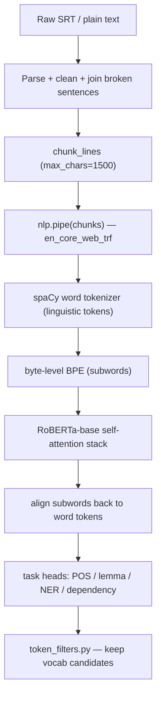

<aside>
🎯

A ground-up explainer of how the LexiFlix subtitle-analysis NLP service works under the hood — from "how does a model turn words into predictions" all the way to RoBERTa and spaCy's `en_core_web_trf`. Written for a CS background with surface-level AI knowledge. Every concept ties back to the real pipeline: `chunk_lines(..., max_chars=1500)` → `nlp.pipe(chunks)` → token filtering.

</aside>

## The big picture

Everything below answers one question through a single lens:

<aside>
🔑

**The lens:** Labeling a word (its part of speech, entity type, lemma) requires _context_ — the surrounding words. Every architecture (CNN, RNN, Transformer) is just a different machine for **mixing surrounding context into each token's representation**. Keep asking: _how does this model incorporate context, and how far can it reach?_

</aside>

The pipeline at a glance:

---

## Part 1 — The actual task

Forget transformers for a moment. What does the pipeline fundamentally do?

For **every token**, it predicts metadata:

- **POS** (part of speech): is "run" a verb or a noun?
- **Lemma**: the dictionary form — "running" → "run", "better" → "good".
- **NER** (named-entity recognition): is "Apple" a company or a fruit?
- **Dependency parse**: which word is this token grammatically attached to?

So at its core this is a **per-token classification problem**. Everything else is machinery for making those predictions _good_.

The central difficulty is **context** — the same word means different things depending on its neighbors:

> "I sat on the river **bank**." → a location
> "I deposited cash at the **bank**." → an organization

Any decent model must let a token's prediction depend on surrounding words. Architectures differ almost entirely in _how_ they mix in that context.

---

## Part 2 — Words must become numbers (embeddings)

Neural networks do arithmetic on numbers, not strings. The first step in _every_ NLP model is mapping each token to a vector of real numbers — an **embedding** — a point in a high-dimensional space (e.g. 300 or 768 dims) where similar words land near each other.

There are two generations of this idea, and the difference unlocks everything else.

### Static embeddings (word2vec, GloVe, ~2013)

One fixed vector per **word type**, stored in a lookup table. "bank" gets **one** vector regardless of sentence — river-bank and money-bank are identical. Context is discarded before the model even starts.

### Contextual embeddings (the modern approach)

Instead of a lookup, you **compute** each token's vector as a function of the whole sentence. Now "bank" gets a different vector in each sentence because the surrounding tokens differ.

<aside>
💡

The entire story of CNNs, RNNs, and Transformers is: **three different machines for computing contextual embeddings.** Once you have a good contextual vector per token, the final POS/NER prediction is just a small classifier on top. The hard part is producing the vector.

</aside>

---

## Part 3 — The three machines for mixing context

### 3a. CNNs — bounded local windows (the small spaCy models)

This is what `en_core_web_sm` / `md` / `lg` use.

A **convolution** slides a small window across the sequence. To compute the vector for token _i_, a 1-D convolution looks at tokens _i−k … i+k_, multiplies them by learned weights, and combines them — repeated for every position.

The key concept is **receptive field** — how far a token's output can "see":

- One conv layer with window ±2 → each output sees 5 tokens.
- Stack a second layer → each output sees outputs that each saw 5 tokens → effectively ±4.
- Stack _n_ layers → receptive field grows roughly linearly with depth.

But it stays **bounded and local**. A 4-layer CNN might see ~15 neighboring tokens and _cannot_ let token 2 directly attend to token 80.

<aside>
✅

This is exactly the intuition "they only look at neighbouring words." It is **true and well-described for the small spaCy models** (which use `HashEmbed` + stacked convolutions + Maxout). It is **not** true for the transformer model.

</aside>

### 3b. RNNs / LSTMs — sequential memory

A **Recurrent Neural Network** reads tokens one at a time, left to right, carrying a **hidden state** (a running summary):

$$
h_t = f(h_{t-1},\ x_t)
$$

In principle the hidden state carries information from arbitrarily far back, so RNNs aren't strictly local like CNNs. **LSTMs/GRUs** add gates that decide what to remember/forget, mitigating the _vanishing gradient_ problem where early information fades.

Two practical weaknesses:

1. **Sequential by nature** — step _t_ can't be computed until step _t−1_ finishes, so they're hard to parallelize on GPUs.
2. **Long-range info still degrades** in practice despite the theory.

<aside>
⚠️

**Correction to an earlier assumption:** spaCy's small models are **CNN-based, not RNN-based.** RNNs were the dominant _pre-transformer_ architecture across much of NLP, which is why they come to mind — but spaCy went the CNN route. Either way, both struggle with cheap _global_ context, which is what motivated transformers.

</aside>

### 3c. Transformers / self-attention — global, all-to-all context

The motivating idea: instead of a fixed window (CNN) or a sequential chain (RNN), let **every token directly look at every other token**, and _learn_ how much to weight each one. This gets its own section.

### Side-by-side

| Property           | CNN (sm/md/lg)        | RNN / LSTM                      | Transformer (trf)    |
| ------------------ | --------------------- | ------------------------------- | -------------------- |
| Context reach      | Local, bounded window | Sequential, fades with distance | Global, all-to-all   |
| Parallelizable?    | Yes                   | No (sequential)                 | Yes                  |
| Cost in length _n_ | O(n)                  | O(n) but serial                 | O(n²)                |
| "Only neighbours"? | True                  | Mostly nearby in practice       | False — fully global |
| Used by            | en_core_web_sm/md/lg  | (not spaCy's defaults)          | en_core_web_trf      |

---

## Part 4 — Self-attention, built up carefully

### The mechanism

Start with each token's vector. From it, the model produces **three** derived vectors via learned weight matrices:

- **Query (q)** — "what am I looking for?"
- **Key (k)** — "what do I offer/advertise?"
- **Value (v)** — "what information do I carry?"

To compute the new, contextualized vector for token _i_:

1. Take token _i_'s **query** and compare it (dot product) against the **key** of _every_ token _j_. The dot product is a relevance score.
2. Run all scores through a **softmax** → weights that sum to 1. These are the **attention weights**: how much token _i_ should attend to token _j_.
3. Output for token _i_ = the weighted sum of every token's **value** vector, using those weights.

$$
\text{Attention}(Q,K,V) = \text{softmax}\!\left(\frac{QK^\top}{\sqrt{d}}\right)V
$$

Concretely, for "deposited cash at the **bank**", the query from "bank" produces a high score against the keys from "deposited"/"cash", so the new "bank" vector gets pulled toward a financial meaning. **The model learned this** — nobody hand-coded "bank attends to money words."

### Why it's the big deal

- **Global context.** Token 2 can attend to token 500 directly, in _one_ step. No window, no chain. This is precisely why "only neighbouring words" is **false** for the transformer.
- **Parallelizable.** Every token's attention is computed simultaneously (matrix multiplication), unlike an RNN's sequential walk. This made training on huge data feasible.
- **Cost.** Every token attends to every token → an _n×n_ score matrix → **O(n²)** compute and memory. This quadratic cost is _why_ there's a maximum sequence length — and ultimately why your chunking exists.

### Two details that make it work

**Multi-head attention**

Attention is done ~12 times in parallel with different learned Q/K/V projections ("heads"). One head may learn syntax, another coreference, etc. Outputs are concatenated — like viewing the sentence through several relationship-lenses at once.

**Positional information**

Raw attention is a _set_ operation with no notion of order ("dog bites man" = "man bites dog"). So a **positional encoding/embedding** is added to each token vector. BERT/RoBERTa use _learned_ absolute position embeddings (a lookup indexed by position 0,1,2,…).

A **Transformer** is just a stack of these self-attention layers (each followed by a small feed-forward network), repeated ~12 times. Each layer refines the contextual vectors using global context.

---

## Part 5 — Encoder vs decoder

Same attention machinery, two configurations differing in **what each token may look at**:

|                       | Encoder (bidirectional)                | Decoder (causal / masked) |
| --------------------- | -------------------------------------- | ------------------------- |
| Each token attends to | All tokens — left _and_ right          | Only tokens _before_ it   |
| Best for              | Understanding / labeling existing text | Generating new text       |
| Examples              | BERT, **RoBERTa**, en_core_web_trf     | GPT and most chat LLMs    |

<aside>
🧩

This is why self-attention is "the same mechanism" as an LLM's but **not identical**: your spaCy transformer is a bidirectional **encoder** (it should use words after "bank" too when labeling it); a typical LLM is a causal **decoder** (it must not peek at the future when predicting the next word). Same math, different masking and training objective.

</aside>

---

## Part 6 — Tokenization (why there are "two tokenizers")

Before any of this, text must be split into units. Two philosophies — and the pipeline uses **both at different layers**.

### Word-level (spaCy's linguistic tokenizer)

Rule-based: split on whitespace/punctuation with language-specific exceptions ("don't" → "do" + "n't", "U.S." stays one token). Deterministic, linguistically meaningful, produces **words**. This is the layer `token_filters.py` operates on — `token.pos_`, `token.lemma_`, `token.is_stop`, etc.

<aside>
📝

This layer **is materially different** from how LLMs tokenize.

</aside>

### Subword (what the transformer uses internally)

Word-level vocab is unbounded (new words, typos, morphology) → many "unknown" tokens. **Subword tokenization** breaks rare words into reusable pieces from a fixed vocabulary (~30k–50k pieces):

- "tokenization" → `token` + `ization`
- "Reykjavik" → `Rey` + `kja` + `vik`

Common algorithms: **BPE (Byte-Pair Encoding)** and **WordPiece**. **Byte-level BPE** (GPT-2 and RoBERTa) operates on raw bytes, so it can encode _any_ string — emoji, any language — with zero true "unknown" tokens.

### Two tokenizers stacked in `en_core_web_trf`

1. spaCy's word tokenizer → linguistic tokens (the ones you filter).
2. The transformer's **byte-level BPE** → subwords for RoBERTa.
3. spaCy **aligns** subword vectors back onto linguistic tokens (pooling "token" + "ization" into one vector for "tokenization"), so downstream heads see one vector per _word_ token.

<aside>
🔁

The nuance: the **outer (word) tokenizer is unlike** an LLM's; the **inner (byte-level BPE) tokenizer is the same family** as GPT-2 / RoBERTa.

</aside>

---

## Part 7 — What RoBERTa actually is

### BERT (Google, 2018) — the bidirectional encoder

BERT is a Transformer **encoder** stack that introduced the **pretrain-then-finetune** paradigm:

- **Pretraining — Masked Language Modeling (MLM).** Hide ~15% of tokens in ordinary text and train the model to predict them _from both directions_: "I deposited cash at the [MASK]" → "bank". Forced to guess from full surrounding context, the model learns deep representations — grammar, semantics, world facts — with **no human labels** (the text is its own answer key).
- **Next Sentence Prediction (NSP).** A second task: given sentences A and B, predict whether B followed A.
- **Finetuning.** Attach a small task head (e.g. a POS classifier) and train briefly on labeled data. The heavy lifting already happened in pretraining.

### RoBERTa (Facebook AI, 2019) — "Robustly optimized BERT approach"

**Same architecture as BERT** (a bidirectional Transformer encoder), but a **better training recipe**. The paper's thesis: BERT was significantly _undertrained_; train it properly and you beat it with no architectural change.

Key recipe changes:

1. **More data, longer training** (~160GB vs BERT's ~16GB) with **much larger batches**.
2. **Dropped NSP** — found unhelpful or harmful.
3. **Dynamic masking** — re-randomizes masked positions each time a sentence is seen (BERT masked once, statically).
4. **Byte-level BPE** tokenizer (50k vocab).

The result: the same encoder produces noticeably better contextual embeddings.

<aside>
🤖

**`roberta-base`** — the model `en_core_web_trf` loads — concretely is:

• **12** transformer layers, hidden size **768**, **12** attention heads, ~**125M** parameters.

• Maximum input length of **512 subword tokens** — the hard ceiling that matters for chunking.

</aside>

So **RoBERTa = a robustly-trained bidirectional Transformer encoder** that turns a sequence of subword tokens into high-quality contextual vectors. That's the engine inside `en_core_web_trf`.

---

## Part 8 — Putting it together in the LexiFlix pipeline

Re-read the code with the full stack in mind:

1. `chunk_lines(..., max_chars=1500)` groups subtitle lines into ~1500-char strings — purely a **batching/throughput** decision (bigger batches = fewer GPU round-trips). Because it groups whole lines, and `_join_broken_sentences` reassembled sentences first, **no sentence is split across a chunk**.
2. `nlp.pipe(chunks, batch_size=..., n_process=1)` runs each chunk through `en_core_web_trf`:
   - spaCy **word tokenizer** → linguistic tokens.
   - **byte-level BPE** → subwords.
   - **RoBERTa-base** self-attention stack → contextual vector per subword (every subword attends to every other _within the span_).
   - **alignment** → one contextual vector per linguistic token.
   - small **task heads** → POS, lemma, NER, dependency.
3. Those tokens flow into `token_filters.py` (`token_should_be_excluded`, etc.) to select vocabulary candidates.

### Chunk vs context window — the precise version

<aside>
📐

- RoBERTa's real **context window = 512 subword tokens** — the span over which self-attention operates.

- Since the transformer can't exceed 512, spaCy's transformer component uses a **span getter** that slices a long `Doc` into windows ≤512 (often slightly overlapping) and runs the transformer per window.

- Your **chunk (~1500 chars ≈ 250–350 words ≈ well under 512 subwords)** typically fits inside a _single_ transformer window — which is why "chunk ≈ context window" _feels_ right.

- But they differ conceptually: the chunk is a **character budget for batching**; the context window is the **512-token attention limit**. The chunk _caps_ context (nothing attends across chunk boundaries) without _being_ the definition of the window.

</aside>

---

## Recap — the original questions, answered

- Do we use a transformer model?
  **Yes.** `en_core_web_trf` wraps **RoBERTa-base**. It produces contextual token embeddings; the POS/NER/dependency components are lightweight task heads that "listen" to those embeddings.
- Is the tokenizer materially different from a modern LLM's?
  **Half true.** There are two tokenizers. spaCy's **outer word-level tokenizer** (rule-based) is materially different from an LLM's. The transformer's **inner byte-level BPE** tokenizer is the _same family_ as GPT-2 / RoBERTa.
- Is the self-attention mechanism similar to an LLM's?
  **Yes, same mechanism**, with one structural difference: RoBERTa is a bidirectional **encoder** (full, non-causal attention); a typical LLM is a causal **decoder** (attends only to earlier tokens). Same math, different masking.
- Is self-attention the most prominent difference from the small spaCy model?
  **Yes — but the small models are CNN-based, not RNN-based.** The prominent difference is **global self-attention vs. a bounded local (windowed CNN) receptive field.**
- Do they "only look at neighbouring words"?
  **True for the CNN small models** (bounded receptive field). **False for the transformer**, where every token attends to every other token in the span. Local cues still dominate POS in practice, but the transformer _can_ use long-range context.
- Is a chunk the same as the context window?
  **Not quite.** A chunk is a character-budget **batching unit** (1500 chars). It _bounds_ attention (nothing crosses chunk boundaries) and is small enough to fit one transformer window, but the true self-attention context window is RoBERTa's **512-subword-token span**.

---

## Glossary

| Term                           | Meaning                                                                                                      |
| ------------------------------ | ------------------------------------------------------------------------------------------------------------ |
| Embedding                      | A token represented as a vector of numbers in a high-dimensional space.                                      |
| Static vs contextual embedding | Static = one fixed vector per word (word2vec). Contextual = computed from the whole sentence (transformers). |
| Receptive field                | How many surrounding tokens can influence a given output; bounded for CNNs.                                  |
| Self-attention                 | Mechanism letting every token weight and aggregate information from every other token via query/key/value.   |
| Multi-head attention           | Several attention computations in parallel, each learning different relationships.                           |
| Positional encoding            | Added signal that tells the order-agnostic attention where each token sits.                                  |
| Encoder / decoder              | Bidirectional (sees all tokens) vs causal (sees only past tokens).                                           |
| BPE / byte-level BPE           | Subword tokenization; byte-level operates on raw bytes so any string is encodable.                           |
| MLM                            | Masked Language Modeling — predict hidden tokens from context; how BERT/RoBERTa pretrain.                    |
| RoBERTa                        | Robustly optimized BERT — same encoder architecture, better training recipe.                                 |
| Span getter                    | spaCy component that slices a long Doc into ≤512-token windows for the transformer.                          |
| Context window                 | Max tokens the model attends over at once — 512 subwords for roberta-base.                                   |
